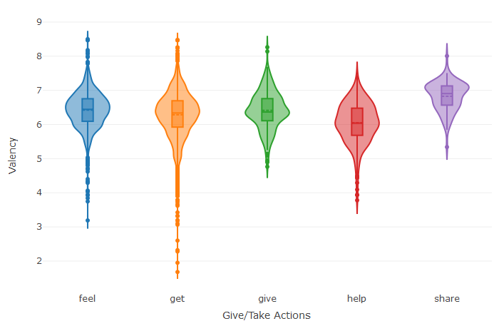

```{r setup, include=FALSE}
knitr::opts_chunk$set(echo = TRUE)
```

## The Happiness Score

You might know what makes you happy, but what makes humans happy in general? Is it good food? Spending time with a loved one? [Asai et al](source_paper.pdf) asked workers on [Mturk](https://www.mturk.com/) to answer the question 'what made you happy in the past 24 hours (or alternatively, the past 3 months)' and what resulted is a juicy dataset of 100,000 happy sentences.

While this dataset was created keeping NLP in mind, I wanted to know if we could understand something more about this unique emotion called 'happiness' through written text. The authors of the happydb paper also shared scores, the Valence, Arousal and Dominance scores (VAD) for each sentence. The VAD model was sourced from the paper by [Bradley and Lang, 1994](VAD_bradley_lang.pdf) and will be used for all further analysis here.


```{r libs, results='hide',echo=FALSE, eval=TRUE, include=FALSE}
#Read the file allThatYouNeed.R before running this file.
library(prettydoc)
library(igraph)
library(ggraph)
library("RDRPOSTagger")
library("tokenizers")
require(spacyr)
library(topicmodels)#for topic modelling using lda
library(tm)
library(textstem)
library(sqldf)
library(tidyverse)
library(tidytext)
library(DT)
library(scales)
library(wordcloud2)
library(gridExtra)
library(ngram)
library(shiny) 
library(tidyr)
library(reshape2)
library(NLP)
library(syuzhet)
library(tm)
library(SnowballC)
library(stringi)
library(topicmodels)
library(plotly)
library(ggplot2)
library(extrafont)
library(tidyr)
library(reshape2)
```

## What does Valence, Arousal and Dominance have to do with my happiness?

Valence is positive or negative affectivity, whereas arousal measures how calming or exciting the information is.
The Semantic Differential Scale devised by Mehrabian and Russell (1974) is a widely used instrument for assessing the 3-dimensional
structure of 18 bipolar adjective pairs that are each rated along a 9-point scale.  

They conceived pleasure as a continuum ranging from extreme pain or unhappiness to extreme happiness and used adjectives such as happy-unhappy, pleased-annoyed, and satisfied unsatisfied to define a person's level of pleasure. Arousal was conceived as a mental activity describing the state of feeling along a single dimension ranging from sleep to frantic excitement and linked to adjectives such as stimulated-relaxed, excited-calm and wide awake-sleepy to define arousal. Dominance was related to feelings of control and the extent to which an individual feels restricted in his behavior. To define the degree of dominance Mehrabian and Russell used a continuum ranging from dominance to submissiveness with adjectives such as controlling, influential and autonomous.  


```{r process1, results='hide',echo=FALSE,eval=TRUE, include=FALSE}
#This section has been adapted from professor's Text_Processing.rmd file.
#But stop words are held.

#Loading the Happy db csv file.
urlfile<-'https://raw.githubusercontent.com/rit-public/HappyDB/master/happydb/data/cleaned_hm.csv'
hm_data <- read_csv(urlfile)

#Creating a corpus and removing punctuations, numbers and empty spaces
corpus <- VCorpus(VectorSource(hm_data$cleaned_hm))%>%
  tm_map(content_transformer(tolower))%>%
  tm_map(removePunctuation)%>%
  tm_map(removeNumbers)%>%
  tm_map(removeWords, character(0))%>%
  tm_map(stripWhitespace)

#Stemming the words
stemmed <- tm_map(corpus, stemDocument) %>%
  tidy() %>%
  select(text)

#Creating a dictionary
dict <- tidy(corpus) %>%
  select(text) %>%
  unnest_tokens(dictionary, text)

#Splitting into words to modify them
completed <- stemmed %>%
  mutate(id = row_number()) %>%
  unnest_tokens(stems, text) %>%
  bind_cols(dict) 

completed <- completed %>%
  group_by(stems) %>%
  count(dictionary) %>%
  mutate(word = dictionary[which.max(n)]) %>%
  ungroup() %>%
  select(stems, word) %>%
  distinct() %>%
  right_join(completed) %>%
  select(-stems)

completed <- completed %>%
  group_by(id) %>%
  summarise(text = str_c(word, collapse = " ")) %>%
  ungroup()

#putting it together in a format easy to use
hm_data <- hm_data %>%
  mutate(id = row_number()) %>%
  inner_join(completed)

datatable(hm_data)


```

```{r process2, results='hide',echo=FALSE, eval=TRUE, include=FALSE}
#This section has been adapted and modified from the professor's HappyDB_RShiny.rmd file

urlfile<-'https://raw.githubusercontent.com/rit-public/HappyDB/master/happydb/data/demographic.csv'
demo_data <- read_csv(urlfile)

# Combine both the data sets and keep the required columns for analysis
hm_data <- hm_data %>%
  inner_join(demo_data, by = "wid") %>%
  select(hmid,
         wid,
         original_hm,
         gender, 
         marital, 
         parenthood,
         reflection_period,
         age, 
         country, 
         ground_truth_category, 
         text) %>%
  mutate(count = sapply(hm_data$text, wordcount)) %>%
  filter(gender %in% c("m", "f")) %>%
  filter(marital %in% c("single", "married")) %>%
  filter(parenthood %in% c("n", "y")) %>%
  filter(reflection_period %in% c("24h", "3m")) %>%
  mutate(reflection_period = fct_recode(reflection_period, 
                                        months_3 = "3m", hours_24 = "24h"))

datatable(hm_data)

### Create a bag of words using the text data

bag_of_words <-  hm_data %>%
  unnest_tokens(word, text)

word_count <- bag_of_words %>%
  count(word, sort = TRUE)

### Create bigrams using the text data

hm_bigrams <- hm_data %>%
  filter(count != 1) %>%
  unnest_tokens(bigram, text, token = "ngrams", n = 2)

bigram_sep <- hm_bigrams %>%
  separate(bigram, c("word1", "word2"), sep = " ")

bigram_sep2 <-bigram_sep %>%
  filter(word1=='i')

#lemmatizing word2 if 'i's:
bigram_sep2$lemma<-lemmatize_words(bigram_sep2$word2)

# Checking how many start with 'i'and what verb follows
bigram_counts <- bigram_sep2 %>%  
  count(word1, lemma, sort = TRUE)
```

Thus, a certain emotional state can be quantified and levels of emotions can be measured.


```{r pic1,echo=FALSE, eval=TRUE}
#wordcloud of top ten action words following 'i'. No giving words at all
bigram_counts[,c(2,3)] %>%
  slice(1:30) %>%
  wordcloud2(size = 0.6,
             rotateRatio = 0)
```

##1. Giving induces more happiness than taking

If your parents ever taught you (which I hope they did) to share and help others, there is a proven reason for it. Analysis of people's experiences show that activities like giving, sharing and helping induces greater levels of pleasure than taking or receiving.


```{r finding1, results='hide',echo=FALSE, eval=TRUE, include=FALSE}
#VAD Scores for HappyDB

#adding vad scores for each hmid
vadurlfile<-'https://raw.githubusercontent.com/rit-public/HappyDB/master/happydb/data/vad.csv'
vadfile <- read_csv(vadurlfile)
happy_vad<-vadfile[!is.na(vadfile$valency),]
happy_vad<-happy_vad[!is.na(happy_vad$dominance),]
happy_vad<-happy_vad[!is.na(happy_vad$arousal),]


i_vad<-sqldf('select happy_vad.hmid,bigram_sep2.word1,bigram_sep2.lemma, happy_vad.valency,happy_vad.dominance,happy_vad.arousal from happy_vad join bigram_sep2 on happy_vad.hmid=bigram_sep2.hmid')

#Investigating the difference between happiness because of giving and taking
give_take<-i_vad[which(i_vad$lemma=='help'|i_vad$lemma=='give'|i_vad$lemma=='feel'|i_vad$lemma=='share'|i_vad$lemma=='get'),]

#tukey test below shows that have-get and give-feel are not statistically different, but others are.
a1<-aov(give_take$valency~give_take$lemma)
tuk<-TukeyHSD(x=a1,'give_take$lemma')
```

```{r plot1, echo=FALSE, eval=TRUE}
#Plotting the findings in a violin plot
# suppressPackageStartupMessages({library(plotly)})
# library(plotly)
find1 <- give_take %>%
  plot_ly(x = ~lemma,y = ~valency,split = ~lemma,type = 'violin',box = list(visible = T),meanline = list(visible = T ))%>%
     layout(xaxis = list(title = "Give/Take Actions"),yaxis = list(title = "Valency",zeroline = F),showlegend=FALSE)
find1
```

##2. You remember events that have a greater emotional impact  


```{r finding2, results='hide',echo=FALSE, eval=TRUE, include=FALSE}
#Testing how 24hrs and 3month arousal values differ:

#hm_df <- read_csv("C:/Users/Deepika/Documents/ADS/Project 1/Fall2018-Proj1-deepikanambo3/doc/processed_moments.csv")
hm_df<-read.csv('~/processed_moments.csv')
ref_df<-sqldf('select happy_vad.*,hm_df.reflection_period from hm_df join happy_vad where hm_df.hmid=happy_vad.hmid')

ref_ind<-sample(1:nrow(ref_df),6000)
ref_df<-ref_df[ref_ind,]
ref_df$refid<-seq(1:nrow(ref_df))


#Testing how males and females arousal values differ:

demo_df<-demo_data
demo_df<-sqldf('select demo_df.*,hm_df.hmid from hm_df join demo_df where hm_df.wid=demo_df.wid')
demo<-sqldf('select happy_vad.*,demo_df.* from demo_df join happy_vad where demo_df.hmid=happy_vad.hmid')
demo<-demo[,-1]

#Taking a sample of 6000
demo_ind<-sample(1:nrow(demo),6000)
demodf<-demo[demo_ind,]
demodf$demoid<-seq(1:nrow(demodf))


#Observing how valency and dominance vary by gender and country
cont_df<-demodf[which(demodf$country=='IND'|demodf$country=='CAN'|demodf$country=='VEN'|demodf$country=='USA'),]
ggplot(cont_df, aes(x=country, y=valency,fill=gender))+geom_boxplot()
ggplot(cont_df, aes(x=country, y=dominance,fill=gender))+geom_boxplot()

#Observing how valency varies by mrital status and country
ggplot(cont_df, aes(x=country, y=valency,fill=marital))+geom_boxplot()

#testing genderwise reflection periods
gen_ref_df<-sqldf('select ref_df.*,demo_df.gender from ref_df join demo_df where ref_df.hmid==demo_df.hmid  ')

#Testing if arousal values are different for different reflection periods
gen_ref_df<-gen_ref_df[which(gen_ref_df$gender=='f'|gen_ref_df$gender=='m'),]

#statistically different arousals
aov_ref<-aov(gen_ref_df$arousal~gen_ref_df$reflection_period)
tuk_ref<-TukeyHSD(x=aov_ref,'gen_ref_df$reflection_period')
tuk_ref
```

A paper by [Cahill and McGaugh](cahill_mcgaugh.pdf) refer Godard's research that electrical stimulation of Amygdaloid complex stimulates arousal and activates the EEG which heightens memory. Our data set proves this research for the case of positive stimuli. A statistically significant difference is found in arousal levels for the 24 hour and 3 month reflection period. The 3 month reflection period has a higher arousal because of which they recollect it to the date of when the question was asked.  


```{r plot2, echo=FALSE, eval=TRUE}

find2 <- ggplot(gen_ref_df, aes(x = reflection_period, y = arousal,fill=gender)) +
  geom_boxplot(alpha=0.5,width=1/length(unique(gen_ref_df$reflection_period)))+
  scale_y_continuous(name = "Arousal",
                     breaks = seq(1.5, 8, 2),
                     limits=c(1.5, 8)) +
  scale_x_discrete(name = "Reflection Period") +
  theme_bw() +
  theme(panel.grid.major = element_line(),
        panel.grid.minor = element_blank(),
        panel.border = element_blank(),
        panel.background = element_blank(),
        plot.title = element_text(size = 14, family = "Tahoma", face = "bold"),
        text=element_text(family = "Tahoma"),
        axis.title = element_text(face="bold"),
        axis.text.x = element_text(colour="black", size = 11),
        axis.text.y = element_text(colour="black", size = 9),
        axis.line = element_line(size=0.5, colour = "black"))+
  scale_fill_brewer(palette = "Accent")
find2

```

##3. Expression of happiness is not just a positive statement

```{r finding3, results='hide',echo=FALSE, eval=TRUE, include=FALSE}
#Calculating VAD scores for tweets

#http://help.sentiment140.com/for-students - this has the data set 1.6 million tweets and classified as 0 = negative, 2 = neutral, 4 = positive. Loading it into R and selecting only the positive ones

#all_twets<-read.csv('C:/Users/Deepika/Documents/ADS/Project 1/Fall2018-Proj1-deepikanambo3/twitterData/twitter_data.csv',header=FALSE)
all_twets<-read.csv('~trainingandtestdata/twitter_data.csv',header=FALSE)
postweets<-all_twets$V6[which(all_twets$V1==4)] #selecting only positive tweets for our analysis
id <- seq.int(length(postweets))
tweets<-data.frame(id=id,pos=postweets)

#Selecting a random sample of 5000 tweets
twt_inds<-sample(1:nrow(tweets),size=5000,replace=FALSE)
twt_data<-tweets[twt_inds,]
tweets<-twt_data

MyCorpus <- VCorpus(VectorSource(tweets$pos))

# helper functions
removeHashTags <- function(x) gsub("#\\S+", " ", x)
removeTwitterHandles <- function(x) gsub("@\\S+", " ", x)
removeURL <- function(x) gsub("http:[[:alnum:]]*", " ", x)
removeApostrophe <- function(x) gsub("'", "", x)
removeNonLetters <- function(x) gsub("[^a-zA-Z\\s]", " ", x)
removeSingleChar <- function(x) gsub("\\s\\S\\s", " ", x)

# remove twitter handles and hashtags
MyCorpus<- tm_map(MyCorpus,content_transformer(removeHashTags))

MyCorpus<- tm_map(MyCorpus,content_transformer(removeTwitterHandles)) 

# other cleaning transformations
MyCorpus <- tm_map(MyCorpus, content_transformer(removeURL))
MyCorpus <- tm_map(MyCorpus, content_transformer(removeApostrophe))
MyCorpus <- tm_map(MyCorpus, content_transformer(removeNonLetters))
MyCorpus <- tm_map(MyCorpus, removeNumbers)
MyCorpus <- tm_map(MyCorpus, content_transformer(tolower))
MyCorpus <- tm_map(MyCorpus, content_transformer(removeSingleChar))

#Stemming the words
stemmed <- tm_map(MyCorpus, stemDocument)%>%
  tidy()%>%
  select(text)

#Creating a dictionary
dict <- tidy(MyCorpus) %>%
  select(text) %>%
  unnest_tokens(dictionary,text)

data("stop_words")

complete_twts <- stemmed %>%
  mutate(id = row_number()) %>%
  unnest_tokens(stem, text) %>%
  bind_cols(dict)%>%
  anti_join(stop_words, by = c("dictionary" = "word"))

#VAD scores for English dowloaded from : http://crr.ugent.be/archives/1003 but also attached in this folder
#vad<-read.csv('C:/Users/Deepika/Documents/ADS/Project 1/Fall2018-Proj1-deepikanambo3/doc/vad_full_set.csv')
vad<-read.csv('~/doc/vad_full_set.csv')
val_avg<-mean(vad$valence)
arsl_avg<-mean(vad$arousal)
dom_avg<-mean(vad$dominance)

#Combining words from tweets and their VAD scores into one dataframe
sel<-sqldf('select complete_twts.id, complete_twts.dictionary, vad.valence, vad.arousal, vad.dominance from vad join complete_twts where vad.Word == complete_twts.dictionary order by complete_twts.id')

#function that takes in a vector(w) and an average(W) that calcultes the VAD score
vad_calculator<-function(w,W){
  if(min(w)>W){
    r<-max(w)-W
  }else if(max(w)<W){
    r<-W-min(w)
  }else {
    r<-max(w)-min(w)
  }
  return(r)
}

val_scr<-c()
arsl_scr<-c()
dom_scr<-c()

#Finding the vad scores for each tweet
for(i in 1:length(unique(sel$id))){
  val_scr[i]<-vad_calculator(sel$valence[which(sel$id==unique(sel$id)[i])],val_avg)
  arsl_scr[i]<-vad_calculator(sel$arousal[which(sel$id==unique(sel$id)[i])],arsl_avg)
  dom_scr[i]<-vad_calculator(sel$dominance[which(sel$id==unique(sel$id)[i])],dom_avg)
}

ids<-seq(1,length(unique(sel$id)))
twt_vad_scores<-data.frame(line=ids,valence=val_scr,arousal=arsl_scr,dominance=dom_scr)

#the VAD scores from happy db:

happy_vad<-vadfile[!is.na(vadfile$valency),]
happy_vad<-happy_vad[!is.na(happy_vad$dominance),]
happy_vad<-happy_vad[!is.na(happy_vad$arousal),]
happy_vad$happyid<-seq(1:nrow(happy_vad))

#taking the same number out of happydb as many rows as tweets we have
happy_ind<-sample(1:nrow(happy_vad),nrow(twt_vad_scores))
happy_db<-happy_vad[happy_ind,]

twts_df<-gather(twt_vad_scores,key,value,-line)
twts_df$source<-rep('tweets',nrow(twts_df))
hap_df<-happy_db[,-5]
hap_df<-gather(hap_df,key,value,-hmid)
hap_df$source<-rep('happydb',nrow(hap_df))
hap_df$key[hap_df$key=='valency']<-'valence'
colnames(hap_df)<-c('line','key','value','source')
df<-rbind(twts_df,hap_df)
df$line<-rep(seq(1:nrow(twt_vad_scores)),6)
```

I wondered how expressing happiness is different from a positive tweet on Twitter. As can be seen from the plots below, recollection of happiness is a far more emotional statement, as can be seen from high VAD scores, than a positive self-declared statement on twitter.  

If you look more closely, tweets have higher arousal, almost as much as happiness statements, because users wouldn't have tweeted something if it did not ctach their attention in the first place. There is an interesting divide between the two datasets for dominance, showing that the respondents to the happydb dataset seem to experience more control and confidence than the twitter users. Valence doesn't show as much a gap because both statements are positive/happy ones.  


```{r plot3, echo=FALSE,  eval=TRUE}
find3 <- ggplot(df, aes(x=line, y=value, color=source, group=source)) +
  geom_point()+
  facet_grid(key ~ ., scale = "free_y")+xlab('Statement Index')+ylab('')
find3

```


## What can I do with these findings?  

Sensing the emotional intent behind a sentence can have various business use cases. It can be used to identify fake reviews on sites like Yelp and TripAdviser, because the score will give the authenticity of a positive review/statement. It can be used to enhance conversion of texts to emojis. VAD scores play a huge role in marketing - successful advertisements induce high valence, low arousal. This dataset can be used to train models and choose the right adjectives and verbs to suit the product segment.


